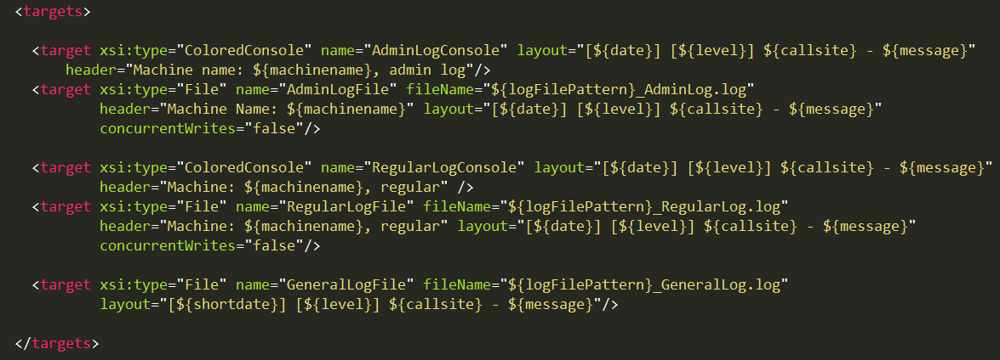
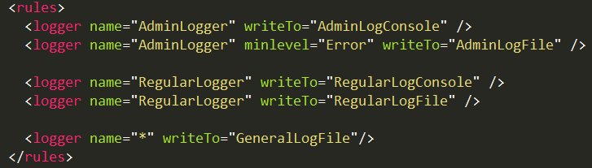

# NLog Test App
Simple app written for testing NLog framework.

## Configuration
NLog configurated with multiple targets.

And multiple rules.

NLog configurated to use multiple log rules
-   export to file
-   export to colored console
-   divided between admin / regular logs
-   admin logger with minimum error level to save

